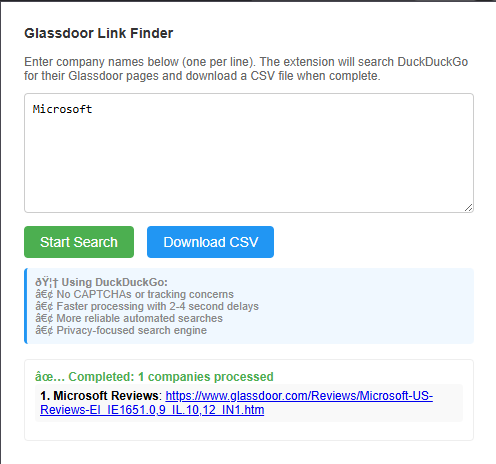

# Glassdoor-Company-Reviews-link-Extractor

A powerful Chrome extension that automatically finds Glassdoor review pages for a list of companies using DuckDuckGo search. Perfect for HR professionals, data analysts, and researchers who need to collect Glassdoor links efficiently.

## 🚀 Features

### ✨ Core Functionality
- **Batch Processing**: Search for multiple companies at once
- **Background Processing**: Continues running even when switching tabs or closing popup
- **Auto CSV Export**: Automatically downloads results when complete
- **DuckDuckGo Integration**: Uses DuckDuckGo to avoid CAPTCHAs and rate limiting
- **Human-like Behavior**: Randomized delays and search patterns to appear natural

### 🎯 Smart Features
- **Persistent State**: Maintains progress across browser sessions
- **Live Updates**: Real-time progress tracking in popup
- **Badge Notifications**: Shows completion status in extension badge
- **Error Handling**: Handles timeouts and missing results gracefully
- **Formatted Output**: Results saved as "Company Name Reviews" format

## 📋 Requirements

- Google Chrome browser (Version 88 or higher)
- Chrome Extension Developer Mode enabled

## 🔧 Installation

### Method 1: Load Unpacked Extension (Recommended)

1. **Download the extension files** to a local folder
2. **Open Chrome** and navigate to `chrome://extensions/`
3. **Enable Developer Mode** (toggle in top-right corner)
4. **Click "Load unpacked"** and select your extension folder
5. **Pin the extension** to your toolbar for easy access

### Method 2: Manual Installation

1. Clone or download this repository
2. Follow the steps above to load the unpacked extension

## 📖 Usage Guide

### Getting Started

1. **Click the extension icon** in your Chrome toolbar
2. **Enter company names** in the textarea (one per line)
3. **Click "Start Search"** to begin processing
4. **Monitor progress** or switch tabs freely - the search continues in background

### Example Input
```
Microsoft
Google
Apple
Amazon
Netflix
Spotify
```

### Features During Processing

- ✅ **Switch tabs freely** - search continues in background
- ✅ **Close/reopen popup** - progress is maintained
- ✅ **Stop search anytime** - saves partial results
- ✅ **Real-time updates** - see live progress every 2 seconds

### Output Format

**Popup Display:**
```
1. Microsoft Reviews: https://glassdoor.com/Reviews/Microsoft-Reviews-E1651.htm
2. Google Reviews: https://glassdoor.com/Reviews/Google-Reviews-E9079.htm
```

**CSV Export:**
```csv
Company Reviews,Glassdoor Link,Notes
"Microsoft Reviews","https://glassdoor.com/Reviews/Microsoft-Reviews-E1651.htm","Success"
"Google Reviews","https://glassdoor.com/Reviews/Google-Reviews-E9079.htm","Success"
"Apple Reviews","NOT FOUND - No Glassdoor results in search","No Results"
```

## 📸 Screenshots

### Extension Interface

**Extension Overview**



*Main extension interface and functionality demonstration*

### Additional Screenshots

*Note: Add more screenshots to the Screenshots folder and update this section with specific use cases:*

**Initial Setup Screen**
<!--  -->
*The main interface where you enter company names and start the search process*

**Processing in Progress**
<!--  -->
*Real-time progress display showing companies being processed in the background*

**Completed Results**
<!--  -->
*Final results showing all found Glassdoor links with download option*

**Chrome Extension Badge**
<!--  -->
*Extension badge notification showing completion status*

### Browser Integration

**Extension in Toolbar**
<!--  -->
*Extension icon pinned to Chrome toolbar for easy access*

**Background Processing**
<!--  -->
*Extension continues working even when popup is closed - showing persistent processing*

**CSV Download**
<!--  -->
*Automatic CSV file download with formatted company review links*

### Sample Output

**Search Results Example**
<!--  -->
*Example of search results showing found Glassdoor links for various companies*

**DuckDuckGo Integration**
<!--  -->
*Behind-the-scenes view of DuckDuckGo search process*

### Extension Management

**Chrome Extensions Page**
<!--  -->
*Extension loaded in Chrome's extension management page*

**Developer Mode**
<!--  -->
*Chrome Developer Mode enabled for loading unpacked extension*

## 🔧 Technical Details

### File Structure
```
extension/
├── manifest.json          # Extension configuration
├── popup.html            # User interface
├── popup.js             # UI logic and state management
├── content.js           # DuckDuckGo page interaction
├── background.js        # Background processing service worker
└── README.md           # This file
```

### Architecture
- **Service Worker**: Handles all search logic and state persistence
- **Content Script**: Extracts Glassdoor links from DuckDuckGo results
- **Popup**: Provides user interface and real-time updates
- **Storage**: Chrome local storage for state persistence

### Search Strategy
1. **Query Variations**: Uses 4 different search patterns to avoid detection
2. **Random Delays**: 2-4 second delays between searches
3. **Background Tabs**: Opens search tabs in background to minimize disruption
4. **Timeout Handling**: 10-second timeout per company search

### Privacy & Performance
- **No Data Collection**: All processing happens locally
- **DuckDuckGo**: Privacy-focused search engine with no tracking
- **Minimal Permissions**: Only requests necessary Chrome APIs
- **Efficient Processing**: Automatic tab cleanup and memory management

## 🛠️ Troubleshooting

### Common Issues

**Extension doesn't start:**
- Ensure Developer Mode is enabled in Chrome
- Check that all files are in the same folder
- Reload the extension in chrome://extensions/

**No results found:**
- Some companies may not have Glassdoor pages
- Check company name spelling
- Try more common company names first

**Process stops unexpectedly:**
- Check Chrome console for errors
- Ensure stable internet connection
- Restart Chrome and try again

**CSV not downloading:**
- Check Chrome's download settings
- Ensure downloads permission is granted
- Try manually clicking "Download CSV"

### Debug Mode

1. **Open Chrome DevTools** (F12)
2. **Go to Console tab**
3. **Look for extension logs** starting with "Background:" or "Content script:"
4. **Check for error messages** in red

## 📊 Performance Tips

### Optimal Usage
- **Batch Size**: Process 10-50 companies at a time for best results
- **Network**: Ensure stable internet connection
- **Resources**: Close unnecessary tabs to free up memory
- **Timing**: Run during off-peak hours for faster processing

### Expected Processing Times
- **Small list (1-10 companies)**: 30 seconds - 2 minutes
- **Medium list (10-50 companies)**: 2-10 minutes
- **Large list (50+ companies)**: 10+ minutes

## 🔒 Privacy & Security

- **Local Processing**: All data stays on your computer
- **No Tracking**: Extension doesn't collect or transmit user data
- **Secure Storage**: Uses Chrome's built-in storage APIs
- **Minimal Permissions**: Only requests access to necessary APIs

## 📝 Changelog

### Version 1.7 (Current)
- ✅ Background processing implementation
- ✅ Persistent state across tab switches
- ✅ Live progress updates
- ✅ Badge notifications
- ✅ Auto CSV download
- ✅ "Company Name Reviews" format

### Previous Versions
- **v1.6**: Persistent extension state
- **v1.5**: DuckDuckGo integration
- **v1.4**: CAPTCHA handling
- **v1.3**: Enhanced error handling
- **v1.2**: Basic functionality

## 🤝 Contributing

This extension is designed for educational and research purposes. Feel free to:
- Report bugs or issues
- Suggest new features
- Improve documentation
- Submit pull requests

## ⚖️ Legal & Ethical Use

### Acceptable Use
- ✅ Research and data analysis
- ✅ HR and recruitment research
- ✅ Academic studies
- ✅ Personal use

### Please Avoid
- ❌ Commercial scraping at scale
- ❌ Violating website terms of service
- ❌ Overwhelming servers with requests
- ❌ Using data for harmful purposes

### Rate Limiting
The extension includes built-in delays and human-like behavior to:
- Respect website resources
- Avoid triggering anti-bot measures
- Maintain ethical usage patterns

## 📞 Support

### Getting Help
1. **Check this README** for common solutions
2. **Review the troubleshooting section**
3. **Check Chrome console** for error messages
4. **Verify extension permissions** are granted

### Best Practices
- Start with small test lists
- Monitor the process initially
- Keep Chrome updated
- Regularly clear browser cache

---

**Built for Employee Retention Analysis Projects** 📈

*This extension was created to streamline the process of collecting Glassdoor company review links for data analysis and research purposes.*
