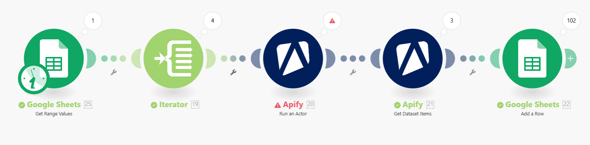

# Glassdoor Data Gathering Using AI Automation

## Overview
This folder contains the automation blueprint for gathering employee review data from Glassdoor using AI-powered tools. The process leverages **Apify** for web scraping and **Make.com** for workflow automation to collect comprehensive employee feedback data for the Glassdoor Companies Review Analysis project.

## 🚦 Workflow Summary

**How It Flows:**
1. **Get company review links** from a Google Sheet
2. **Iterate through each link** using BasicFeeder
3. **Send each link** to Apify's Glassdoor review scraper actor
4. **Fetch all results** from Apify (reviews in JSON)
5. **Insert each review row** into a new Google Sheet, preserving all fields

### Visual Workflow

*Make.com automation workflow showing the 5-step process from Google Sheets input to Apify scraping to data output*

### Key Workflow Steps:

#### 1. Read Glassdoor Review Links from Google Sheets
- **Module**: Google Sheets – Get content from the "Glassdoor_Companies_Reviews" sheet, range B42:B100
- **Purpose**: Collects the list of Glassdoor review URLs to scrape

#### 2. Iterator (Feeder)
- **Module**: Built-in Iterator (BasicFeeder)
- **Purpose**: Iterates through each Glassdoor URL from the previous step, processing one link at a time

#### 3. Run Apify Actor: Glassdoor Reviews Scraper
- **Module**: Apify – Run Actor (cAbCkTzBPP0HFO50f)
- **Input**: Each Glassdoor link (wrapped as a startUrls array in JSON)
- **Parameters**: Scrapes up to 100 reviews per link using Apify's Glassdoor scraper actor with residential proxies enabled for reliability
- **Execution**: Runs synchronously - waits for each actor run to finish before proceeding

#### 4. Fetch Scraped Reviews from Apify Dataset
- **Module**: Apify – Fetch Dataset Items
- **Purpose**: Gets the JSON output (all reviews data) from the dataset generated by the previous actor run

#### 5. Write Reviews to Google Sheets
- **Module**: Google Sheets – Add Row(s)
- **Purpose**: Appends all extracted review fields to a new sheet ("Glassdoor Reviews"), column-mapped with headers for every field (pros, cons, ratings, job title, date, location, etc.)

## 🛠️ Tools Used

### 1. **Apify**
- **Purpose**: Web scraping Glassdoor company reviews
- **Actor Used**: `Glassdoor Reviews, Interviews, Locations, Salary, Job, Overview` (cAbCkTzBPP0HFO50f)
- **Features**: 
  - Automated review extraction
  - Residential proxy rotation for reliability and fewer blocks
  - Structured JSON output
  - Rate limiting compliance
  - Batch scraping (one company review page per loop iteration)

### 2. **Make.com (formerly Integromat)**
- **Purpose**: Workflow automation and data pipeline orchestration
- **Features**:
  - Visual workflow builder
  - Google Sheets integration
  - Error handling and retry logic
  - Synchronous execution (waits for completion)
  - Scheduled execution

## 📋 Process Workflow Details

The data gathering process follows a 5-step automated workflow with **batch processing**:

### Step 1: Input Data Source
- **Module**: Google Sheets Reader
- **Action**: Reads Glassdoor company URLs from Google Sheets
- **Source Range**: Cells B42:B100 from "Glassdoor_Companies_Reviews" sheet
- **Purpose**: Provides target company URLs for scraping

### Step 2: URL Processing
- **Module**: Basic Feeder
- **Action**: Iterates through each company URL
- **Purpose**: Prepares individual URLs for parallel processing
- **Processing Mode**: One link at a time for reliability

### Step 3: Web Scraping
- **Module**: Apify Actor Runner
- **Action**: Executes Glassdoor scraper for each company
- **Configuration**:
  - **Max items per company**: 100 reviews (customizable)
  - **Timeout**: 60 seconds
  - **Proxy**: Residential proxy group for better reliability
  - **Review types**: Employee reviews only
  - **Execution**: Synchronous - waits for each run to complete
- **Output**: Structured JSON data with review details

### Step 4: Data Extraction
- **Module**: Apify Dataset Fetcher
- **Action**: Retrieves scraped data from Apify dataset
- **Format**: Clean JSON format
- **Processing**: Data transformation and cleaning

### Step 5: Data Storage
- **Module**: Google Sheets Writer
- **Action**: Writes extracted data to destination spreadsheet
- **Target**: "Glassdoor Reviews" sheet
- **Method**: Row-by-row insertion with complete field mapping
- **Mapping**: All 33 review fields preserved in separate columns

## 📊 Data Schema

The scraping process extracts **33 key data points** per review with **complete field mapping**:

### Review Content
- `Advice` - Employee advice to management
- `Cons` - Negative aspects of working at the company
- `Pros` - Positive aspects of working at the company
- `Summary` - Review title/summary
- `prosOriginal` - Original language pros text

### Review Metadata
- `countHelpful` - Number of helpful votes
- `countNothelpful` - Number of not helpful votes
- `Featured` - Whether review is featured
- `flaggingdisabled` - Flagging status
- `reviewdatetime` - Review submission timestamp

### Employee Information
- `Employement Status` - Employment status (Regular, Former, etc.)
- `isCurrent Job` - Whether still employed
- `job title` - Employee's job position
- `Job title type` - Job title classification
- `length of employement` - Duration of employment
- `location` - Work location
- `location type` - Location classification
- `location type2` - Secondary location type

### Company Information
- `Employeer Type` - Employer classification
- `Employeer ID` - Unique company identifier
- `Employeer Name` - Company name

### Ratings (Scale 1-5)
- `rating Overall` - Overall company rating
- `ratingWorkLifeBalance` - Work-life balance rating
- `ratingCultureAndValues` - Culture and values rating
- `ratingCareerOpportunities` - Career opportunities rating
- `ratingCompensationAndBenefits` - Compensation and benefits rating
- `ratingSeniorLeadership` - Senior leadership rating
- `ratingBusinessOutlook` - Business outlook rating
- `ratingCEO` - CEO approval rating
- `ratingRecommendToFriend` - Recommendation to friend
- `ratingDiversityAndInclusion` - Diversity and inclusion rating

### Technical Fields
- `language` - Review language code
- `original language id` - Original language identifier

## 📁 Files in this Folder

### `blueprint (8).json`
- **Type**: Make.com automation blueprint
- **Size**: 47KB (1,160 lines)
- **Purpose**: Complete workflow configuration
- **Usage**: Can be imported into Make.com to replicate the automation

### `Workflow.png`
- **Type**: Visual workflow diagram
- **Size**: 81KB
- **Purpose**: Screenshot of the Make.com automation workflow
- **Shows**: 5-step process from Google Sheets input → Iterator → Apify scraping → Data fetching → Google Sheets output

### `README.md`
- **Type**: Documentation file
- **Purpose**: Comprehensive guide to the data gathering process
- **Includes**: Setup instructions, data schema, and technical specifications

## 📈 Output Dataset

The scraping process generated a comprehensive dataset stored in `/Datasets/Glassdoor Reviews.csv`:

- **File Size**: 5.8MB
- **Format**: CSV (Comma-separated values)
- **Columns**: 33 data points per review with complete field mapping
- **Sample Companies**: JPMorgan Chase and other major employers
- **Processing**: Batch scraping with up to 100 reviews per company
- **Use Case**: Glassdoor Companies Review Analysis and sentiment mining

## 🚀 How to Use

### Prerequisites
1. **Make.com account** with sufficient operations quota
2. **Apify account** with scraping credits
3. **Google Sheets API** access
4. **Target company URLs** in Google Sheets

### Setup Instructions
1. Import `blueprint (8).json` into Make.com
2. Configure connections:
   - Google Sheets connection
   - Apify connection
3. Update spreadsheet IDs and ranges
4. Test the workflow with a small dataset
5. Schedule or run manually

### Best Practices
- **Rate Limiting**: Respect Glassdoor's terms of service
- **Data Quality**: Validate scraped data for completeness
- **Error Handling**: Monitor for failed scraping attempts
- **Data Privacy**: Ensure compliance with data protection regulations
- **Batch Processing**: Process companies one at a time for reliability

## 🔧 Configuration Parameters

### Apify Actor Settings
```json
{
    "includeAllReviews": false,
    "includeAllSalaries": false,
    "includeCompanyBenefitsStats": false,
    "includeCompanyInterviewStats": false,
    "includeCompanyReviewStats": false,
    "maxItems": 100,
    "monitoringModeForReviews": false,
    "proxy": {
        "useApifyProxy": true,
        "apifyProxyGroups": ["RESIDENTIAL"]
    }
}
```

### Make.com Workflow Settings
- **Execution Mode**: Synchronous processing (waits for completion)
- **Error Handling**: Auto-retry with 3 max errors
- **Data Loss Prevention**: Enabled
- **Timeout**: 60 seconds per company
- **Processing**: Batch scraping - one company review page per loop

## 📝 Key Features & Notes

- **Batch Processing**: One Glassdoor company review page per loop iteration
- **Customizable Limits**: Maximum of 100 reviews per company (adjustable in input)
- **Complete Field Mapping**: All review fields (advice, pros, cons, job title, ratings, location, summary, etc.) are mapped to separate columns in the new Google Sheet
- **Residential Proxies**: Used in Apify for better reliability and fewer blocks
- **Synchronous Execution**: Waits for each actor run to finish before proceeding
- **Scalability**: Can process 100+ companies in a single run
- **Reliability**: Built-in retry logic for failed requests
- **Data Quality**: Extracts structured, consistent data format
- **Integration**: Seamless Google Sheets integration for analysis
